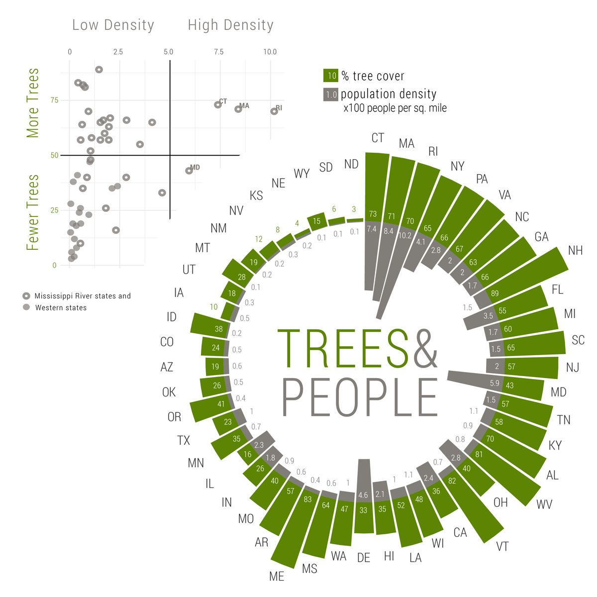
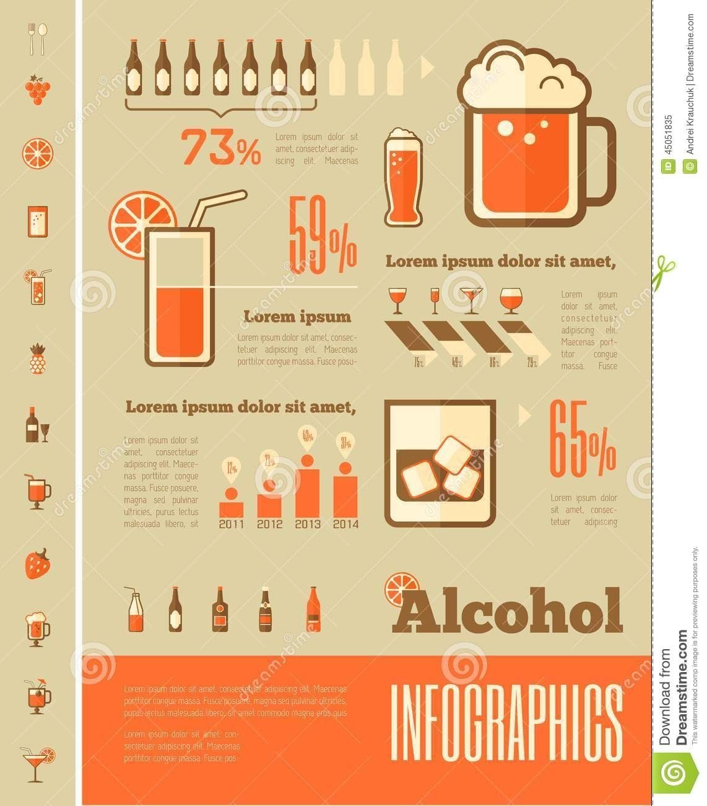
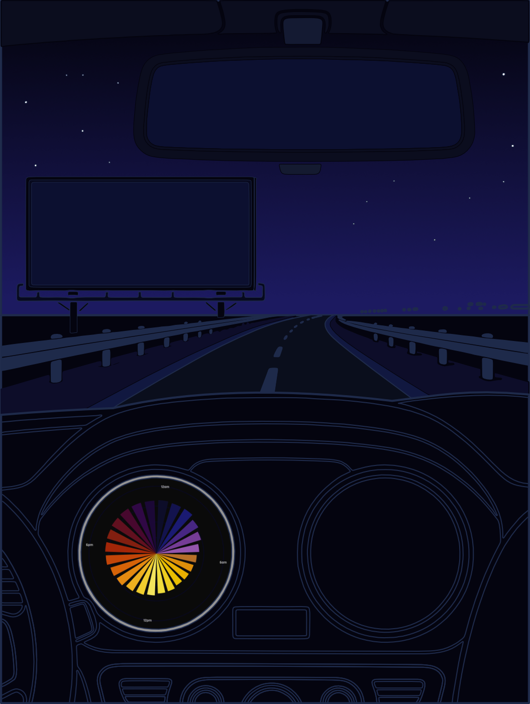
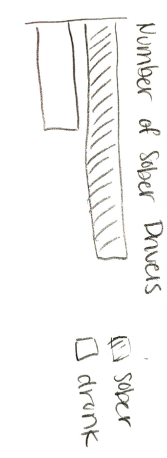
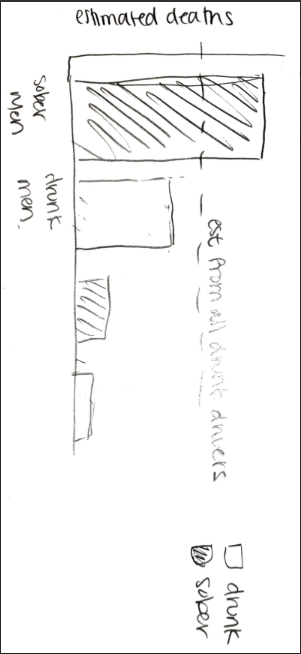
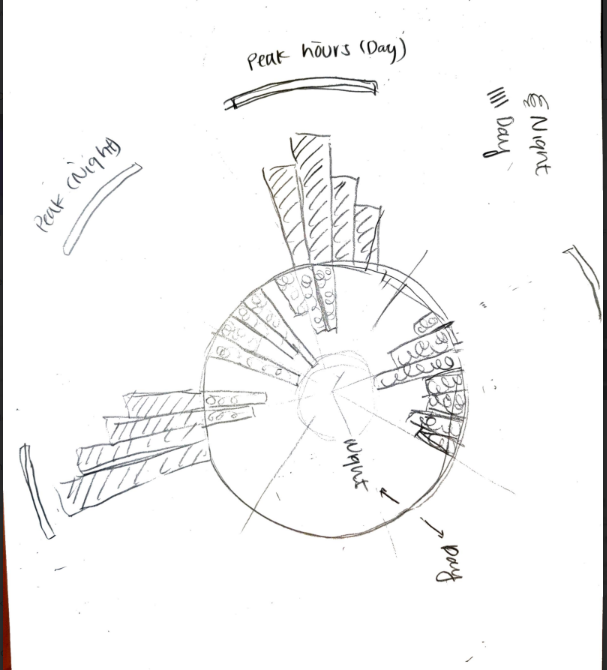

## III. Pre-Planning

**1. Restate the questions you hope to answer with your infographic. This should include one overarching question (think of this as driving the overall theme of your infographic) and at least three subquestions (each of which will be addressed by your infographic's component visualizations). Have these questions changed at all since FPM #1? If yes, how so?**

*Response:* The overarching question driving my infographic is: does the drunk driving narrative actually hold up when you look at the data, or is it just a convenient villain? My infographic is a deadpan parody of the kind of scary public health PSA you've probably seen, dark backgrounds, bold alarming statistics, the works. The joke is that using the same California crash data, just framed differently, you can "prove" that driving is dangerous period and you might as well have a good time doing it. Each panel tackles one common claim about drunk driving and "debunks" it using real numbers that are technically true but presented in a deliberately misleading way. The three subquestions are: (1) Do drunk drivers actually cause most crashes, or are sober drivers the larger source of crashes on California roads? (2) Given that the temporal patterns of overall crashes and alcohol-impaired crashes don't align, total crashes peak during morning commute hours while drunk driving crashes concentrate late at night, can this mismatch be used to contradict the idea that drunk driving is responsible for the most dangerous conditions on the road? (3) Given that sober male drivers account for more estimated fatalities than all drunk drivers combined, can a gender x sobriety breakdown be framed to make gender look like the culpable variable, and does that form a convincing enough misrepresentation of what's actually causing fatal crashes?

These questions have changed since FPM #1, becoming more focused and specific, but still serve the same goal of highlighting the power of data manipulation. I've reoriented the whole project around a specific rhetorical argument, the infographic is now a parody, designed to look like a legitimate PSA while using real statistics in misleading ways. The blog post that goes with it will walk through how each panel manipulates the data and why it works.

------------------------------------------------------------------------

**2. Explain which variables from your data set(s) you will use to answer the above questions, and how.**

*Response:* I'm working with two CSV files from the California Highway Patrol's SWITRS database, one at the crash level and one at the party level (one row per driver involved). I join them on `CollisionId` after filtering down to at-fault, non-emergency drivers only. The cleaning lives in `exploration.qmd` and outputs a joined dataset called `crash_clean`. The key variables I'm using are:

-   **`sobriety`**: derived from `SobrietyDrugPhysicalCode1` in the party file: code `"A"` = no alcohol, code `"B"` = alcohol impaired. Anything else gets dropped.
-   **`fatal`**: a logical flag for whether anyone died, derived from `NumberKilled > 0`.
-   **`hour`**: extracted from `CrashDateTime`, so I can look at crash timing across the day.
-   **`gender_code`**: the at-fault driver's sex (`"M"` / `"F"`), from the party file.
-   **`est_deaths`**: a derived variable I compute as crashes x fatality rate within each gender x sobriety group, which is what I use to make the Myth 3 argument.

**Visualization 1 (Myth 1)** just shows crash counts by sobriety, sober drivers account for \~213k crashes vs \~29k for alcohol-impaired. By using raw counts instead of rates, the chart makes sober driving look like the bigger danger, which is technically true and deliberately misleading.

**Visualization 2 (Myth 2)** plots `hour` by `sobriety` and lets the temporal mismatch do the work, overall crashes peak during morning commute hours while drunk driving crashes concentrate after midnight. The infographic places these side by side to imply that since the two patterns don't align, alcohol can't be what's causing the most dangerous conditions.

**Visualization 3 (Myth 3)** uses `gender_code`, `sobriety`, and `est_deaths` to show that sober male drivers account for more estimated deaths (\~341) than all drunk drivers combined (\~301). Broken into four bars, sober men come out on top, which lets me frame gender as the "real" variable and kind of wave away alcohol as a red herring.

------------------------------------------------------------------------

**3. Find at least two data visualizations that you could (potentially) borrow / adapt pieces from. Download and embed them into your drafting-viz.qmd file, and explain which elements you might borrow.**

*Response:*



From [this visualization](https://www.azandisresearch.com/2019/07/19/create-a-radial-mirrored-barplot-with-ggplot/) I plan to borrow the mirrored style of radial plot.



From this visualization I plan to borrow the cool alcohol percentage representation and maybe other style/font items, esp for my billboard!


------------------------------------------------------------------------

## IV. Hand-Drawn Sketches





------------------------------------------------------------------------

## V. Code-Based Visualizations

```{r}
#| label: setup
library(tidyverse)
library(here)
library(patchwork)
library(scales)
library(sysfonts)
library(showtext)
library(ggtext)

# ── Data ──────────────────────────────────────────────────────────────────────
# Raw files: CA Highway Patrol SWITRS database, crashes + parties CSVs (2024).
# Download portal: https://iswitrs.chp.ca.gov
# Cleaning, filtering to at-fault drivers, and joining the two files is
# documented in exploration.qmd. The processed file was saved there with:
#   write_csv(crash_clean, here("data/processed/crash_clean.csv"))
crash_clean <- read_csv(here("data/processed/crash_clean.csv"),
                        show_col_types = FALSE)

# ── Font ──────────────────────────────────────────────────────────────────────
# "rajdhani" is the family name used in all family = "rajdhani" calls below
font_add_google("Rajdhani", "rajdhani")
showtext_auto()

# ── Color palette ─────────────────────────────────────────────────────────────
PAL <- list(
  plot_bg      = "#07091E",  # chart background — deep indigo
  bg           = "#0D0F28",  # page background, used in myth 2 patchwork panel
  alcohol      = "#FF3333",  # red — alcohol-impaired / danger
  sober        = "#4DB8FF",  # blue — sober / safe
  text_primary = "#FFFFFF",  # titles
  text_muted   = "#7A8EBB",  # subtitles
  text_axis    = "#A8BCD8",  # axis labels
  grid_line    = "#1A2550"   # grid lines
)

# ── Shared theme ──────────────────────────────────────────────────────────────
# Applied to all three charts; individual charts add overrides on top.
dashboard_theme <- theme_void() +
  theme(
    plot.background    = element_rect(fill = PAL$plot_bg, color = NA),
    panel.background   = element_rect(fill = PAL$plot_bg, color = NA),
    panel.grid.major.y = element_line(color = PAL$grid_line),
    axis.text.x = element_text(
      color = PAL$text_axis, size = 25,  # large enough to read on polar clock face
      face = "bold", family = "rajdhani"
    ),
    plot.title = element_text(
      color = PAL$text_primary, hjust = 0.5,  # centered
      face = "bold", family = "rajdhani",
      size = 35, margin = margin(b = 2)  # tight gap below title
    ),
    plot.subtitle = element_text(
      color = PAL$text_muted, hjust = 0.5,  # centered
      size = 20, family = "rajdhani",
      margin = margin(t = 2, b = 6)  # small top, more breathing room below
    ),
    plot.margin = margin(10, 15, 8, 15)  # top right bottom left
  )
```

------------------------------------------------------------------------

### Visualization 1 -- Myth 1: "Sober Drivers Don't Cause Most Crashes"

*Shows raw crash counts by sobriety. Sober drivers account for \~88% of crashes. By reporting counts instead of rates, the chart makes sober driving look like the bigger danger -- technically true, deliberately misleading.*

```{r}
#| label: fig-myth1
#| fig-cap: "Myth 1 -- Raw crash counts by sobriety: sober drivers cause 88% of crashes"
#| fig-width: 9.5
#| fig-height: 2.5

fmt_n <- label_number(scale_cut = cut_short_scale())

myth1_data <- crash_clean |>
  filter(!is.na(sobriety)) |>
  distinct(collision_id, sobriety) |>
  count(sobriety) |>
  mutate(
    pct    = round(n / sum(n) * 100),
    driver = if_else(sobriety == "No alcohol", "SOBER\nDRIVERS", "DRUNK\nDRIVERS"),
    label  = paste0(fmt_n(n), "  \u00b7  ", pct, "%  ")
  )

ggplot(myth1_data, aes(x = n, y = reorder(driver, n), fill = sobriety)) +
  geom_col(width = 0.7) +  # narrower than default; breathing room between bars
  geom_text(
    aes(label = label),
    hjust = 1.05,  # flush against right edge of bar, inside
    color = "white", family = "rajdhani", fontface = "bold", size = 6
  ) +
  scale_fill_manual(
    values = c("No alcohol" = PAL$sober, "Alcohol impaired" = PAL$alcohol),
    guide  = "none"
  ) +
  scale_x_continuous(expand = expansion(mult = c(0.02, 0))) +  #left padding
  labs(
    title    = "SOBER DRIVERS CAUSE MORE CRASHES",
    subtitle = "Raw crash counts \u00b7 CA SWITRS 2024",
    x = NULL, y = NULL
  ) +
  dashboard_theme +
  theme(
    axis.text.y = element_text(color = PAL$text_axis, size = 18, family = "rajdhani"),
    axis.text.x = element_blank(),
    panel.grid  = element_blank()
  )
```

------------------------------------------------------------------------

### Visualization 2 -- Myth 2: "Drunk Driving Makes the Roads Dangerous for Everyone"

*Juxtaposes crash timing for all crashes (left, morning rush peak) against alcohol-impaired crashes (right, 2am peak -- shown at 2.2x expanded y-scale to make the pattern look minor). The mismatch implies drunk driving can't be responsible for the most dangerous conditions.*

```{r}
#| label: fig-myth2
#| fig-cap: "Myth 2 -- Polar clock charts: all crashes peak at rush hour; alcohol-impaired crashes peak at 2am"
#| fig-width: 9
#| fig-height: 5

all_crashes <- crash_clean |>
  distinct(collision_id, hour) |>
  count(hour)

alc_crashes <- crash_clean |>
  filter(sobriety == "Alcohol impaired") |>
  distinct(collision_id, hour) |>
  count(hour)

p_all <- ggplot(all_crashes, aes(x = factor(hour, levels = 0:23), y = n)) +
  geom_col(width = 0.72, fill = PAL$alcohol) +  # slight gap between clock segments
  coord_polar() +
  scale_x_discrete(
    breaks = c("0", "6", "12", "18"),  # label quarter-hours only
    labels = c("12am", "6am", "12pm", "6pm")
  ) +
  scale_y_continuous(expand = expansion(mult = c(0, 0.12))) +  # headroom above peak bar
  labs(
    title    = "ALL CRASHES BY HOUR",
    subtitle = "Morning commute is the deadliest window"
  ) +
  dashboard_theme +
  theme(
    panel.grid.major.y = element_line(color = PAL$grid_line, linewidth = 0.7),  # thicker for polar readability
    plot.title    = element_text(color = PAL$text_primary, hjust = 0.5, face = "bold", family = "rajdhani", size = 18),  # smaller: half-width panel
    plot.subtitle = element_text(color = PAL$text_muted,   hjust = 0.5, family = "rajdhani", size = 12)
  )

# Expanded y-axis so alcohol bars only reach ~45% of clock face,
# making the pattern look minor and clearly misaligned with the left chart
p_alc <- ggplot(alc_crashes, aes(x = factor(hour, levels = 0:23), y = n)) +
  geom_col(width = 0.72, fill = PAL$alcohol) +
  coord_polar() +
  scale_x_discrete(
    breaks = c("0", "6", "12", "18"),
    labels = c("12am", "6am", "12pm", "6pm")
  ) +
  scale_y_continuous(
    limits = c(0, max(alc_crashes$n) * 2.2),  # 2.2x makes bars fill ~45% of face
    expand = expansion(mult = c(0, 0.12))
  ) +
  labs(
    title    = "ALCOHOL-IMPAIRED CRASHES BY HOUR",
    subtitle = "Fewer crashes -- and the peak doesn't match"
  ) +
  dashboard_theme +
  theme(
    panel.grid.major.y = element_line(color = PAL$grid_line, linewidth = 0.7),
    plot.title    = element_text(color = PAL$text_primary, hjust = 0.5, face = "bold", family = "rajdhani", size = 18),
    plot.subtitle = element_text(color = PAL$text_muted,   hjust = 0.5, family = "rajdhani", size = 12)
  )

p_all + p_alc +
  plot_annotation(
    title = "IF DRUNK DRIVING CAUSED THE DANGER, THE PEAKS WOULD ALIGN",
    theme = theme(
      plot.title = element_text(
        color = PAL$text_primary, hjust = 0.5,  # centered over both panels
        face = "bold", family = "rajdhani", size = 14
      ),
      plot.background = element_rect(fill = PAL$bg, color = NA)
    )
  )
```

------------------------------------------------------------------------

### Visualization 3 -- Myth 3: "Drunk Driving Is What's Killing Californians"

*Breaks down estimated deaths (crashes x fatality rate) by gender and sobriety. Sober men account for more estimated deaths than all drunk drivers combined. The dashed reference line marks the sum of estimated deaths across both drunk driver groups.*

```{r}
#| label: fig-myth3
#| fig-cap: "Myth 3 -- Estimated deaths by gender and sobriety: sober men exceed all drunk drivers combined"
#| fig-width: 9
#| fig-height: 4.5

myth3_data <- crash_clean |>
  filter(!is.na(sobriety), gender_code %in% c("M", "F")) |>
  distinct(collision_id, gender_code, sobriety, fatal) |>
  group_by(gender_code, sobriety) |>
  summarize(
    est_deaths = round(n() * mean(fatal, na.rm = TRUE)),
    .groups    = "drop"
  ) |>
  mutate(
    group_label = case_when(
      gender_code == "M" & sobriety == "No alcohol"       ~ "SOBER MEN",
      gender_code == "M" & sobriety == "Alcohol impaired" ~ "DRUNK MEN",
      gender_code == "F" & sobriety == "No alcohol"       ~ "SOBER WOMEN",
      gender_code == "F" & sobriety == "Alcohol impaired" ~ "DRUNK WOMEN"
    ),
    group_label = factor(
      group_label,
      levels = c("SOBER MEN", "DRUNK MEN", "SOBER WOMEN", "DRUNK WOMEN")
    )
  )

# Sum of estimated deaths for drunk men + drunk women combined
all_drunk <- myth3_data |>
  filter(sobriety == "Alcohol impaired") |>
  pull(est_deaths) |>
  sum()

ggplot(myth3_data, aes(x = group_label, y = est_deaths, fill = sobriety)) +
  geom_col(width = 0.6) +  # narrower columns; more whitespace between groups
  geom_hline(
    yintercept = all_drunk,
    linetype = "dashed", color = PAL$alcohol, linewidth = 0.8, alpha = 0.8
  ) +
  annotate(
    "text",
    x = 0.6, y = all_drunk - 18,  # left of first bar, above reference line
    label = paste0("Est. Number of Deaths from Drunk Drivers - Cumulative: ", all_drunk),
    color = PAL$alcohol, hjust = -.95,  # left-aligned
    family = "rajdhani", size = 4.2
  ) +
  geom_text(
    aes(label = est_deaths),
    vjust = -0.4,  # just above bar top
    family = "rajdhani", fontface = "bold", size = 4.5,
    color = "white"
  ) +
  expand_limits(y = max(myth3_data$est_deaths) * 1.2) +  # 20% headroom for value labels
  scale_fill_manual(
    values = c("Alcohol impaired" = PAL$alcohol, "No alcohol" = PAL$sober),
    guide  = "none"
  ) +
  labs(
    title    = "SOBER MEN ARE <span style='color:#FF3333'>DEADLIER</span><br>THAN ALL DRUNK DRIVERS COMBINED",
    subtitle = "Estimated deaths = crashes \u00d7 fatality rate, by gender and sobriety",
    x        = NULL,
    y        = "Estimated deaths"
  ) +
  dashboard_theme +
  theme(
    axis.text.x        = element_text(color = PAL$text_axis, size = 14, family = "rajdhani"),
    axis.text.y        = element_text(color = PAL$text_axis, size = 14, family = "rajdhani"),
    panel.grid.major.y = element_line(color = PAL$grid_line),
    panel.grid.major.x = element_blank(),
    plot.title         = element_markdown(  # allows HTML color span in title
      color = PAL$text_primary, hjust = 0.5,
      face = "bold", family = "rajdhani",
      size = 35, margin = margin(b = 2)
    )
  )
```

------------------------------------------------------------------------

## VI. Reflection

**1. What are the key insights you want your infographic to communicate, and how will your design choices help highlight and support those messages?**

*Response:* The whole point is to show, completely deadpan, that driving is just dangerous, and that alcohol's role in that is really easy to manipulate depending on how you frame the numbers. Every design choice is trying to make the parody look like a real PSA: dark color palette, bold scary statistics, polar clock charts that feel authoritative and serious. The manipulation is baked into the framing rather than the chart type; Myth 1 uses counts instead of rates, Myth 2 uses side-by-side juxtaposition to imply a causal argument it never actually makes, and Myth 3 buries the rate story under an absolute count breakdown. The idea is that a data-literate reader would pause at each one rather than immediately clock it as wrong.

------------------------------------------------------------------------

**2. What challenges did you encounter or anticipate encountering as you continue to build / iterate on your visualizations in R?**

*Response:* The hardest part of this project is making the misleading visualizations feel convincing, while also clearly satire upon further inspection, instead of immediately obviously wrong. Things like cutting the y-axis, using a log scale, or making weak conclusions are easy to spot when they aren't done well, the challenge is making choices that feel reasonable long enough to have the view considering the implications.

------------------------------------------------------------------------

**3. What ggplot extension tools / packages do you need to use to build your visualizations? Are there any that we haven't covered in class that you'll be learning how to use for your visualizations?**

*Response:* I'm using `coord_polar()` in `ggplot2` for the clock and Nightingale charts, `patchwork` for laying out panels side by side, and `showtext`/`sysfonts` to load a custom font (Rajdhani) that fits the dashboard aesthetic. I will also be using affinity for the layout and design elements, anything that I don't know how to do with ggplot, I will likely try to do there.

------------------------------------------------------------------------

**4. What feedback do you need from the instructional team and / or your peers to ensure that your intended message and key insights are clear?**

*Response:* The main thing I want feedback on is whether the parody reads as informative satire or as a foolish joke in bad taste. Or more generally, after looking over the infographic, is it clear that this is a joke at all? (I do not want to be be seen as genuinely advocating for drunk driving). I'm not sure whether I need some kind of framing device, a subtitle, a tone signal, something, to make the satire land, or whether playing it completely straight is actually what makes it work. I'd also love feedback on the Myth 3 panel specifically: the "sober men kill more than all drunk drivers combined" argument feels solid to me but I'm not sure if the four-bar breakdown is self-explanatory or if it needs more annotation to guide the reader to the (absurd) conclusion I'm going for.
